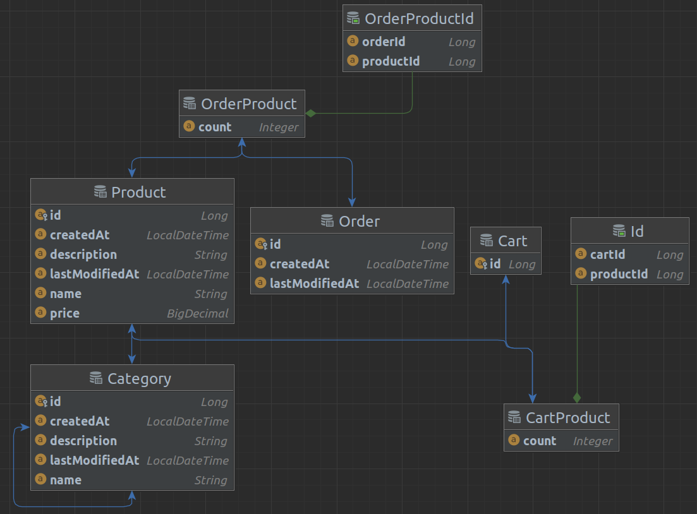

# Project Idea: Online Marketplace

## Description:
Create an online marketplace where users can buy and sell products. The application will allow users to search for products, view product details, add products to cart, checkout, and make payments.

## Features:
- [ ] Users can search for products by category, name, and price.
- [ ] Users can view product details including description, price, and images.
- [ ] Users can add products to their cart and checkout.
- [ ] Users can make payments using different payment gateways like PayPal, Stripe, etc.
- [ ] Users can manage their orders, view order history, and track order status.
- [ ] Admin users can manage products, categories, and orders.

## Optional Features:

- [ ] Rating and review system for products.
- [ ] Social media integration for sharing products.
- [ ] Recommendation engine to suggest products to users based on their purchase history.
- [ ] Integration with shipping APIs to track shipments.

## Technologies:

- [x] Spring Boot for the back-end.
- [ ] Flutter for building the UI.
- [ ] Bootstrap or any front-end framework for responsive UI.
- [ ] PostgreSQL for the database.
- [ ] Spring Security for authentication and authorization.
- [ ] Spring Data JPA for data access.
- [ ] Integration with payment gateways like PayPal, Stripe, etc.

## Database Model
As of 10/03/23:

